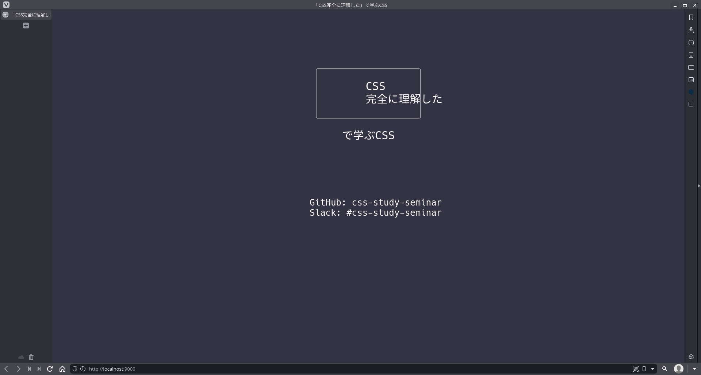

# Section 0

## コマンドライン操作

はじめに、コマンドラインの基本操作について説明をします。本資料ではしばしば、以下のような記述が登場します。
```bash
$  echo "Hello, World!"
Hello, World!
```
これは、`echo "Hello, World!"`というコマンドを実行し、その実行結果として`Hello, World!`という出力が得られたことを表しています。`$`マークがコマンドの前に記述されることが多いですが、これはコマンドには含まれません。<br>

### 基本操作

#### ディレクトリ (フォルダ) の移動
- Windows / Linux

  ```bat
  $  cd bin
  ```

#### 現在いるディレクトリ (フォルダ) のパスを表示
- Windows

  ```bat
  $  cd
  ```

- Linux

  ```bash
  $  pwd
  /home/ryokohbato/develop/css-study-seminar/normal
  ```

#### 現在いるディレクトリの内容を表示
- Windows
  ```bat
  dir
  ```

- Linux
  ```bash
  $  ls -al
  drwxr-xr-x   - ryokohbato 29  7月 15:09 obj
  .rw-r--r-- 176 ryokohbato 29  7月 15:09 Program.cs
  .rw-r--r-- 163 ryokohbato 29  7月 15:09 sample.csproj
  ```

#### ディレクトリ (フォルダ) を作成
- Windows / Linux

  ```bash
  $  mkdir bin
  ```

#### ファイルをコピー
- Windows

  ```bat
  $  copy test.txt dist\
  ```

- Linux

  ```bash
  $  cp test.txt dist/
  ```

#### ファイルを削除
- Windows

  ```bat
  $  del test.txt
  ```

- Linux

  ```bash
  $  rm test.txt
  ```

コマンドラインからファイルを削除した場合、もとに戻せない (ゴミ箱から復元できない) ので、注意が必要です。

## 環境構築

1. Node.jsをインストール ([n](https://github.com/tj/n)などのNode.jsバージョン管理用ツールを使用する場合は、各ツールの指示に従ってください。)

以下のようにして、Node.jsがインストールされたことを確認することができます。

```bash
$  node --version
v14.17.3
```

2. GitHubから、任意のフォルダにリポジトリをクローン (以下はSSHの例)

```bash
$  git clone git@github.com:kmc-jp/css-study-seminar.git
```

3. 動作確認

Normal用のフォルダに移動

```bash
$  cd css-study-seminar/normal/
```

必要なパッケージをインストール
```bash
$  npm install
```

サンプルプロジェクトを起動
```bash
$  npm run sample
```

ここまでで、自動的にウェブブラウザが起動し、以下の画面が表示されていれば、環境構築および動作確認は完了です。


