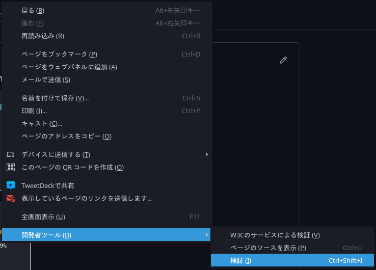

# Section 4 : CSS演習1・開発者ツールの使い方

## 演習

### stylusの導入

[openstyles/stylus](https://github.com/openstyles/stylus) を導入することで、好きなページに自由にCSSを追加していくことができます。

- Chromium-based : [Chrome Web Store](https://chrome.google.com/webstore/detail/stylus/clngdbkpkpeebahjckkjfobafhncgmne)
- Firefox : [Firefox add-ons](https://addons.mozilla.org/ja/firefox/addon/styl-us/)

### 開発者ツール

ウェブページのいずれかの場所で右クリックをして、コンテキストメニューから選択することで起動できます。 (ブラウザによって異なります。)

